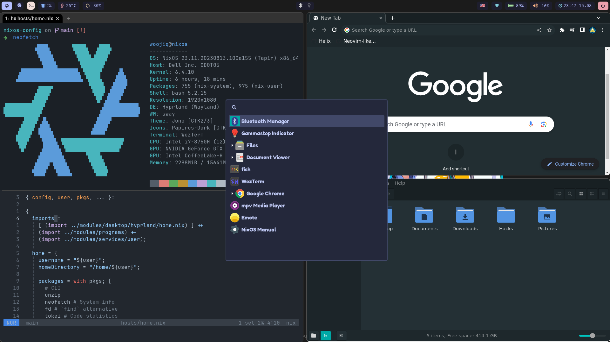

### TODO
* Alt-tab (like on Windows).
* Use nix-colors module ??? 🤔.
* Change VT-colors using `setvtrgb`.
* Chrome sometimes is not hardware accelerated.

# Gallery

# Credits
* @<!-- -->MatthiasBenaets for his [YT](https://github.com/MatthiasBenaets/nixos-config) tutorials.
* @<!-- -->pennae for reviewing my first [PR](https://github.com/NixOS/nixpkgs/pull/221321) to `nixpkgs`.

# License
The software is licensed under the [MIT License](LICENSE).

Note: MIT license does not apply to the packages built by Nixpkgs,
merely to the files in this repository (the Nix expressions, build
scripts, NixOS modules, etc). It also might not apply to patches
included in Nixpkgs, which may be derivative works of the packages to
which they apply. The aforementioned artifacts are all covered by the
licenses of the respective packages.